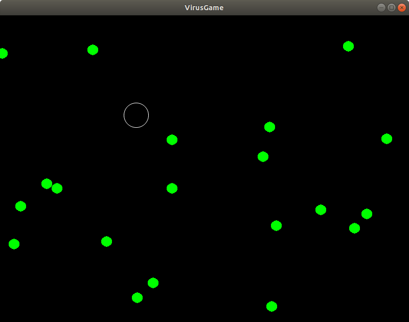

# README #

VirusGame, a simple game build using the SDL2 graphics library. Use
the cursur keys to move and escape/kill the viruses.

## Install

### Linux/Mac:

Using the package manager on your system install:

    cmake
    git
    libsdl2-dev
    libsdl2-gfx-dev

For Ubuntu use: sudo apt install cmake git libsdl2-dev libsdl2-gfx-dev

Then 

    git clone https://bterwijn@bitbucket.org/bterwijn/virusgame.git
    cd VirusGame/src
    mkdir build
    cd build
    cmake ..
    make
    ./VirusGame

### Windows:

Install [git](https://git-scm.com/download/win) and clone
[VirusGame](https://bitbucket.org/bterwijn/virusgame/src/master).

Install [Visual Studio Studio Community
2019](https://visualstudio.microsoft.com/) and in the Visual Studio
Installer install Worksload "Desktop development with C++".

To install the SDL2 graphics library use
[vcpkg](https://github.com/Microsoft/vcpkg) by using:

    git clone https://github.com/Microsoft/vcpkg.git
    cd vcpkg
    .\bootstrap-vcpkg.bat
    .\vcpkg.exe integrate install
    .\vcpkg.exe install sdl2
    .\vcpkg.exe install sdl2-gfx --triplet x64-windows

Then in Visual Studio Studio Community 2019 open the virusgame/src
folder and build the project (F7) and run it (F5).

## Author
Bas Terwijn <b.terwijn@uva.nl>
